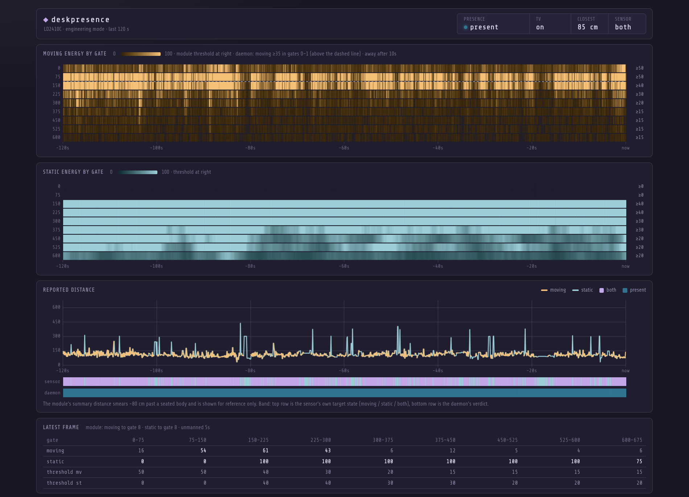
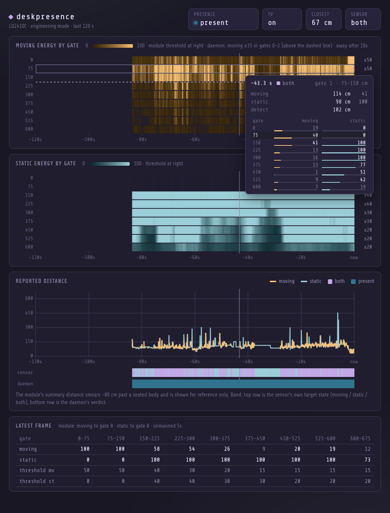

# deskpresence

Turns the TV off when nobody is at the desk and back on the moment someone
is. A 24 GHz mmWave presence sensor (Hi-Link LD2410C) on a USB UART feeds a
small Go daemon that keeps one invariant:

    TV on  <=>  someone within reach of the sensor

It replaces idle blanking. Keyboard activity, idle inhibitors and playing
video are irrelevant. Only bodies count, so a film keeps playing while you
watch it and the screen goes dark seconds after you walk away, even if a
download is still running.

The daemon also fades PipeWire audio and pauses MPRIS players on the way
out, resumes them on the way back, and serves a live view of the sensor at
http://127.0.0.1:7391 for tuning.

## How it works

The LD2410C reports ten times a second. In engineering mode each report
carries a moving-energy and a static-energy value (0 to 100) for each of nine
range gates, 75 cm apart. The daemon reads only the moving energy of the
first few gates, the ones that cover the chair:

- **Present** when moving energy in any of the first `-near-gates` gates is at
  least `-energy-min`, held for `-debounce` (500 ms) before the TV comes on.
- **Absent** when that has not been true for `-absence`. Single-frame blips
  neither count as presence nor restart the absence clock.
- **No opinion** when the sensor has been silent for `-stale` (5 s). The daemon
  holds whatever state it is in.

Why not the module's own presence output or its summary distance? The
summary distance smears about 80 cm past a seated body, the static channel
is blind inside 150 cm and saturated by the room beyond it, and the module's
built-in verdict flickers. Per-gate moving energy at the chair is the one
signal that separates a person sitting still from an empty room. Basic
frames (no gate data) fall back to "target within `-max-distance`".

The actuator is any script that takes `on` or `off`. The daemon compares the
desk state with the TV state file every 250 ms and acts whenever they
disagree, with a 30 s to 10 min backoff for a failing actuator. It is
level-triggered: if something else turns the TV off while you are reading,
it comes back on within a few seconds.

Around the edges:

- `-fade` (5 s) dims the screen and PipeWire streams before absence latches,
  so the cut is not a surprise. Streams listed in `-audio-exclude` are left
  alone. Volumes are remembered by application and restored on return.
- MPRIS players are paused on leave and resumed on return (`-no-mpris` to
  disable).
- A logind delay inhibitor turns the TV off before suspend. After resume the
  policy resets and the sensor decides again.
- A dead sensor is the dangerous case on an OLED, because nothing blanks it.
  After `-alert-after` (2 min) of silence the daemon speaks and posts a
  critical notification, then repeats hourly. A sensor that has never been
  seen since start does not alert, so the unit can sit enabled before the
  hardware is plugged in.

## Parts

| Part | Notes |
|---|---|
| Hi-Link LD2410C | 24 GHz mmWave, 5 V, UART at 256000 baud. The C variant has the 1.27 mm 5-pin header. |
| CP2102 USB to UART bridge | Needs a 5 V pin, not just 3.3 V. Any CP210x board works; the default `-port` glob matches it. |
| Four short leads | Enamelled speaker wire works and doubles as the mount. |
| Heat-shrink | For the two leads that cross. See assembly. |
| Optional 1.27 mm header | If you would rather not solder leads to the module. |

The module has no reverse-polarity protection. Check VCC and GND twice.

## Assembly

1. **Solder to the module.** The 5-pin edge is VCC, GND, OUT, RX, TX. OUT is
   the module's own presence pin and is not used. Solder either a header or
   four leads directly to VCC, GND, RX and TX.
2. **Cross the data lines.** UART is crossed: the bridge's transmit goes to
   the module's receive.

        CP2102 5V  -> LD2410C VCC
        CP2102 GND -> LD2410C GND
        CP2102 TXD -> LD2410C RX
        CP2102 RXD -> LD2410C TX

3. **Insulate the crossing.** With enamelled wire, RX and TX cross each other
   with nothing but enamel between them. Slip heat-shrink over each of those
   two leads before you bend anything into place. A bare crossing works until
   the enamel wears through, then the port goes silent for no visible reason.
4. **Power from 5 V.** The module regulates its own 3.3 V. Feeding it 3.3 V
   directly gives erratic frames or none.
5. **Mount and aim.** Stiff wire is enough to hold the module; a housing is
   not needed. The antenna patches (the flat side without components) face
   the chair, roughly at seat height and within 150 cm of it. Do not point it
   down a hallway or at a door.
6. **Plug in.** The bridge appears as
   `/dev/serial/by-id/usb-Silicon_Labs_CP2102_USB_to_UART_Bridge_Controller_*`.
   On Arch, add yourself to `uucp` if you get permission denied:

        sudo usermod -aG uucp $USER

## First run

    go install .
    deskpresence -verbose            # print every frame
    deskpresence config show         # module parameters (daemon must be stopped)

Open http://127.0.0.1:7391 for the live view: two heatmaps (moving and
static energy by gate over the last 120 s), the reported distance, and a
band showing the sensor's own state against the daemon's verdict. The
dashed line on the moving heatmap is the daemon's near-gate boundary.
Hover anywhere for that frame's numbers, with the gate under the pointer
highlighted:

The module ships in basic mode. `deskpresence` switches it to engineering
mode on connect, so the gate data appears within a second.

## Calibration

Thresholds depend on the chair, the distance and the room, so measure
rather than guess. With the live view open:

1. Sit still for a minute. Read the highest moving energy in the near gates
   (the rows above the dashed line). Breathing and small movements keep it
   well above zero.
2. Walk out of the room for 30 s. Read the highest value the same rows reach
   with nobody there.
3. Pick `-energy-min` between the two, closer to the empty-room number.
4. Pick `-absence` for the longest gap a still reader leaves between
   frames above the threshold, times two. A seated person's moving energy
   spikes every few seconds, but a four-minute recording of reading with
   hands off the desk showed one gap of 10 s, so 10 s is not enough.
   `-fade` starts dimming before absence latches; one breath cancels it.

Measured at this desk, module about 1 m from the chair:

| | Gates 0 and 1 (0 to 150 cm) | Gate 2 (150 to 225 cm) |
|---|---|---|
| Typing | peaks 100 every few seconds, mean 55 to 73 | 50 to 100 |
| Reading, hands off | peaks 33 to 53 every 5 s, longest gap above 38 was 10 s | |
| Room empty | mostly under 30, single frames of 32 to 38 | blips of 35 to 86 |

Which gives the unit file's `-near-gates 2 -energy-min 38 -absence 20s -fade 8s`.
Static energy does not help here: the module reports none for gates 0 and
1, and gates 2 and 3 read 100 with the room empty.
The third gate was in the rule at first; it turned out to carry energy from
beyond the desk (a body in the next room reads through drywall), and one
walk-away test kept the TV on for a full minute because of it. Keep the
near gates to where the chair actually is and let the empty-room maximum
set the threshold.

If a gate beyond the chair picks up the room (a fan, a corridor), lower its
sensitivity in the module rather than widening the daemon's rule:

    deskpresence config sens <gate|all> <movingSens> <staticSens>
    deskpresence config gates <maxMovingGate> <maxStaticGate> <unmannedSeconds>
    deskpresence config factory

A sensitivity of 100 disables a gate. Settings persist in the module.

## Run as a service

    install -Dm644 systemd/deskpresence.service -t ~/.config/systemd/user/
    systemctl --user enable --now deskpresence

Edit the `ExecStart` flags in the unit to your calibrated values. While
tuning:

    touch $XDG_RUNTIME_DIR/deskpresence.pause    # observe only, never act
    deskpresence -dry-run -replay present:5s,absent:70s,present:3s -absence 60s
    cat ~/.local/state/deskpresence/status.json
    journalctl --user -u deskpresence -f

`status.json` is rewritten on every change and is what a bar or chip reads:

    rule       near_gates, energy_min, absence_ms, max_distance
    present    the daemon's verdict
    known      false until the first frame
    since      ms timestamp of the last verdict change
    fade       0 to 1, how far into the pre-absence dim
    sensor_ok  false when frames have stopped
    tv         on, off, or "" when the state file is missing
    busy       actuator running
    paused     pause file present
    state      the sensor's own target state (0 none, 1 moving, 2 static, 3 both)
    distance   the sensor's summary distance in cm

`history.json` beside it holds the last 60 s at 2 Hz: `near[]` (max
near-gate moving energy per bin), `present[]`, `threshold` and `bin_ms`.

## Flags

| Flag | Default | Purpose |
|---|---|---|
| `-port` | `/dev/serial/by-id/*CP210*` | serial device, glob allowed |
| `-baud` | `256000` | the module default |
| `-near-gates` | `3` | gates (75 cm each) that count as the desk; 0 uses `-max-distance` |
| `-energy-min` | `40` | moving energy in a near gate that counts as presence |
| `-max-distance` | `250` | basic frames only: ignore targets farther than this (cm) |
| `-debounce` | `500ms` | presence must hold this long before the TV comes on |
| `-absence` | `60s` | desk must be empty this long before the TV goes off |
| `-stale` | `5s` | no frames for this long means no opinion |
| `-fade` | `5s` | start dimming this long before absence latches; 0 disables |
| `-alert-after` | `2m` | sensor silent this long triggers the spoken and desktop alert |
| `-script` | `~/.config/hypr/scripts/tv-screen.sh` | actuator, called with `on` or `off` |
| `-state` | `~/.config/lgtv/state` | TV state file the actuator writes |
| `-status` | `~/.local/state/deskpresence/status.json` | status output |
| `-pause-file` | `$XDG_RUNTIME_DIR/deskpresence.pause` | while present, observe but never act |
| `-http` | `127.0.0.1:7391` | live view address; empty disables |
| `-no-audio-fade` | | leave PipeWire streams alone |
| `-audio-exclude` | `emotune,speech-dispatcher` | application names never faded |
| `-no-mpris` | | do not pause or resume players |
| `-dry-run` | | log actions instead of running the actuator |
| `-replay` | | synthesise frames, e.g. `present:5s,absent:70s` |
| `-verbose` | | log every frame |

## Integrations

**Actuator.** Any executable taking `on` or `off`. It should serialise on its
own lock and write the state it achieved (`on` or `off`) to the `-state`
file, because the daemon trusts that file rather than remembering what it
asked for. The bundled default is an LG webOS script that talks to the TV
over its API, which avoids DPMS entirely (an NVIDIA FRL link that loses a
modeset race stays at 60 Hz until reboot).

**Bars and chips.** Read `status.json`. It changes only when something
changed, so polling it once a second is cheap.

**Idle daemons.** Keep swayidle or similar as a last-resort burn-in guard
with a long timeout rather than removing it. If it fires while someone is
reading, this daemon turns the TV back on within a few seconds. The state
file makes a double `off` harmless.

## Licence

MIT.
